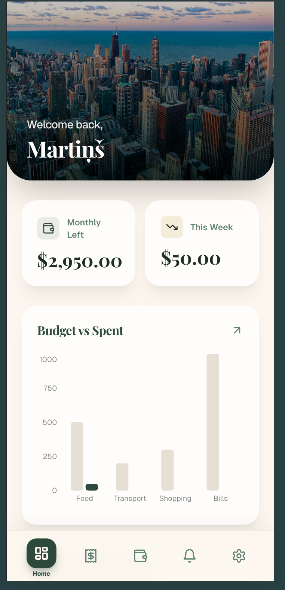
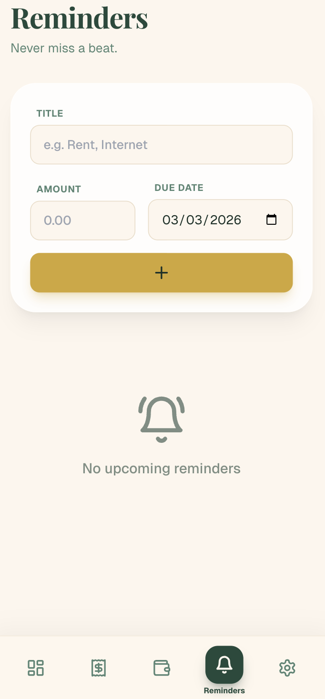
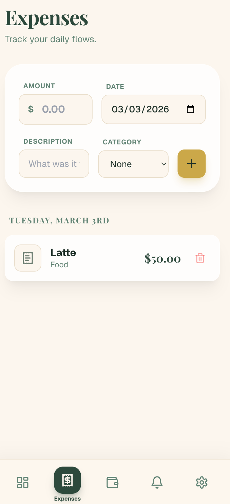
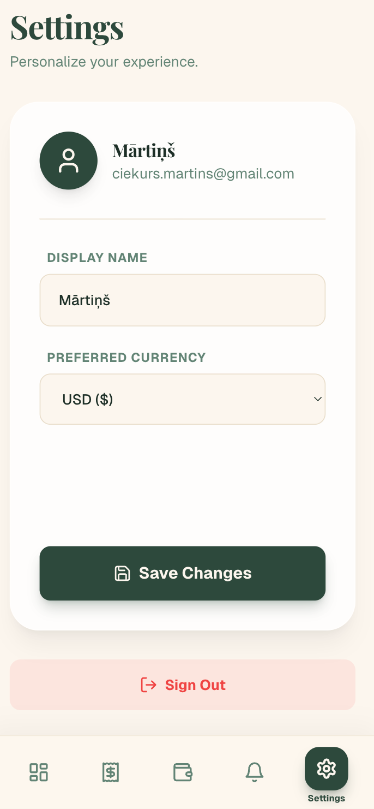
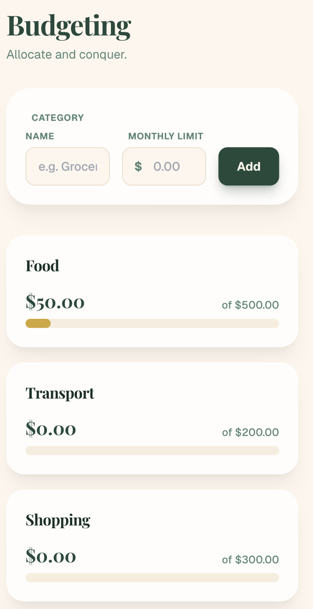
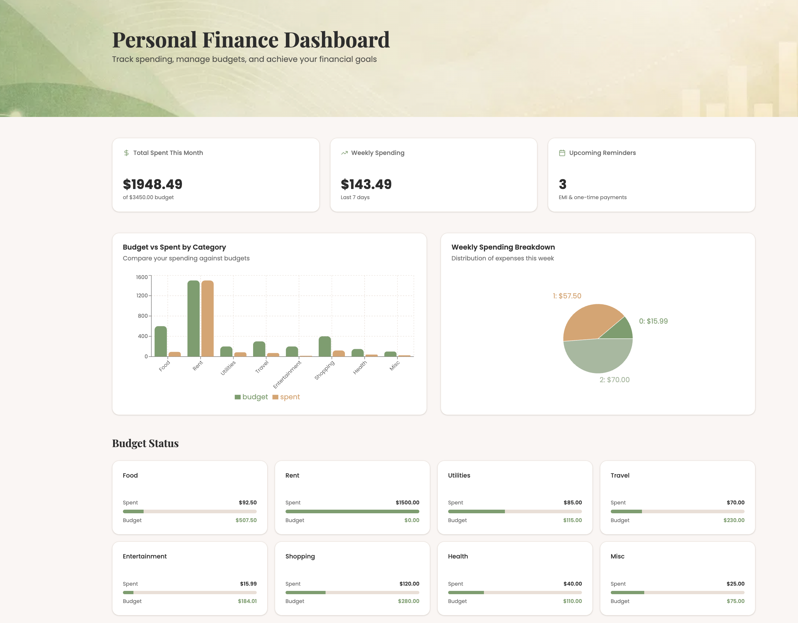
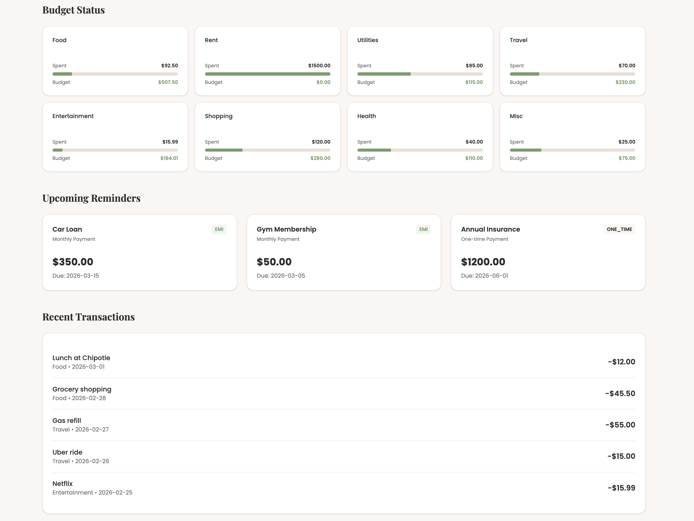
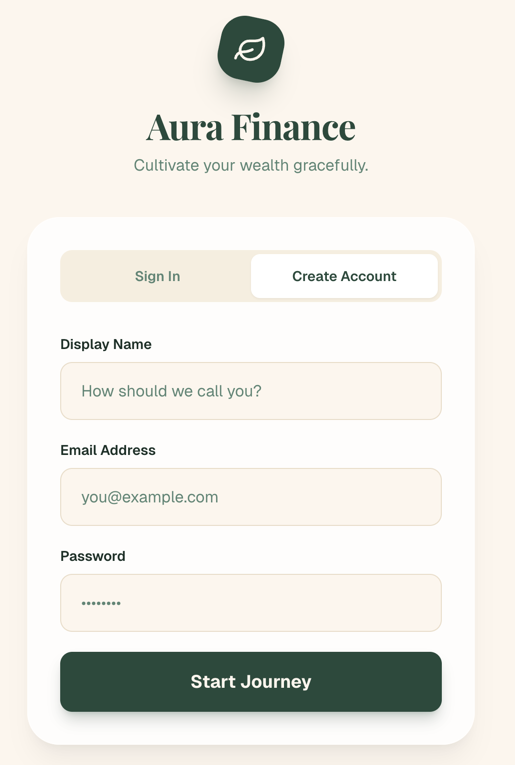
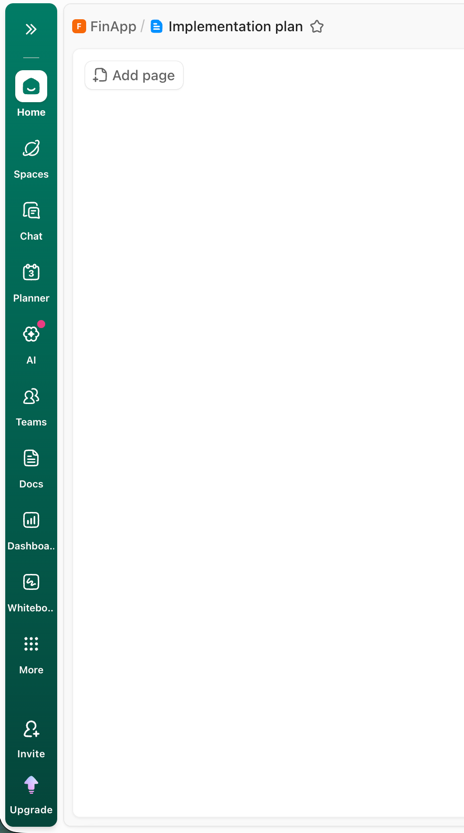

# Implementation Plan

# Project Specification: Personal Finance Dashboard

**Target Audience**: Busy Young Professionals

**Core Philosophy**: Clean, fast, inline-first UX with a warm, sophisticated aesthetic. AI-augmented where it genuinely helps. Subtle animations that make the experience feel alive. Mobile-first, installable as a PWA.

---

## 1. Design & Aesthetic Direction

The application moves away from "tech-cold" blues and whites toward a warm, earthy palette that feels grounded and premium.

### Color Palette

All colors defined as CSS custom properties via Tailwind theme config using HSL values. Both light and dark themes ship in v1.

| Role        | Hex Code  | Usage                              |
| ----------- | --------- | ---------------------------------- |
| Background  | `#fdf6ee` | Main page background (Warm Cream)  |
| Card        | `#ffffff` | Surface areas and containers       |
| Primary     | `#2d4a3e` | Buttons, active states (Dark Olive)|
| Accent      | `#c9a84c` | Chart highlights, gold accents     |
| Muted       | `#f5ede0` | Secondary backgrounds (Light Beige)|
| Foreground  | `#1a1a1a` | High-contrast body text            |
| Destructive | `#dc3545` | Error states and delete actions    |

### Typography

- **Headings**: `Playfair Display` (Serif) - Elegant, editorial feel.
- **Body**: `Geist Sans` (Sans-serif) - Readability and modern speed.

### Icons

- `lucide-react` - Used sparingly and intentionally. Icons appear in navigation, category badges, summary cards, and action buttons. Never decorative-only.

### Animations (Framer Motion)

Subtle, purposeful animations throughout:
- **Page transitions**: Fade + slight vertical slide between dashboard routes.
- **List items**: Staggered entrance when transactions/reminders load.
- **Cards**: Gentle scale-up on mount, micro-hover lift.
- **Inline form**: Smooth expand/collapse when adding a transaction.
- **AI suggestions**: Fade-in with a slight blur-to-clear effect as suggestions appear.
- **Toast notifications**: Slide-in from top with spring physics.
- **Number changes**: Animated counting for summary totals (e.g., "Total Spent" ticks up).
- **Onboarding steps**: Slide transitions between steps with progress indicator animation.
- **Voice input**: Pulsing microphone icon while recording, circular countdown timer for the 30-second limit.

Keep all animations under 300ms. Respect `prefers-reduced-motion`.

### Dark Mode

Both light and dark themes ship in v1. Default follows system preference (`prefers-color-scheme`), user can override in settings (System / Light / Dark). Persisted in `localStorage` and `profiles.theme_preference`.

- All colors referenced via CSS custom properties (never hardcoded hex in components).
- shadcn/ui theming convention: HSL values in `globals.css` under `:root` (light) and `.dark` (dark). Use `next-themes` for toggle logic + SSR-safe hydration (avoids flash).
- All components use semantic color tokens (`bg-background`, `text-foreground`, `bg-card`, etc.) - never raw colors like `bg-white` or `text-black`.
- Images/illustrations must work on both backgrounds. Banner photos get a subtle dark overlay in dark mode for readability.

#### Dark Palette

| Role        | Light         | Dark            |
| ----------- | ------------- | --------------- |
| Background  | `#fdf6ee`     | `#1a1a1a`       |
| Card        | `#ffffff`     | `#252525`       |
| Primary     | `#2d4a3e`     | `#5b9a82`       |
| Accent      | `#c9a84c`     | `#d4b85a`       |
| Muted       | `#f5ede0`     | `#2a2a2a`       |
| Foreground  | `#1a1a1a`     | `#f0ebe4`       |
| Destructive | `#dc3545`     | `#e05563`       |

---

## 2. Tech Stack

The following is the suggested starting stack. It is not rigid - popular, well-maintained libraries should be used where appropriate. Specific packages may be added, swapped, or removed during implementation as needs become clearer.

| Layer            | Technology                                       |
| ---------------- | ------------------------------------------------ |
| Framework        | Next.js 16 (App Router, Server Components)       |
| Language         | TypeScript (strict mode)                         |
| Styling          | Tailwind CSS 4 + shadcn/ui                       |
| Database         | Supabase (Postgres + RLS)                        |
| Auth             | Supabase Auth (email/password)                   |
| AI               | Vercel AI SDK (provider-agnostic, start Gemini)  |
| Validation       | Zod (shared schemas for forms, API, AI output)   |
| Forms            | react-hook-form + @hookform/resolvers/zod        |
| Charts           | Recharts                                         |
| Animations       | Framer Motion                                    |
| Icons            | lucide-react                                     |
| Dates            | date-fns                                         |
| Theming          | next-themes                                      |
| Toasts           | Sonner                                           |
| Billing          | Stripe (Checkout + Customer Portal)              |
| Email            | Resend (transactional emails for reminders)      |
| Bot              | Telegram Bot API (Grammy)                        |
| Testing          | Vitest + React Testing Library + Playwright      |
| Deployment       | Vercel                                           |
| PWA              | next-pwa (or `@serwist/next`)                    |

---

## 3. Database Schema (Supabase)

All tables use Row Level Security (RLS). All IDs are **UUIDv7** (time-sortable, generated by `gen_random_uuid()` or application-side with a UUIDv7 library). All tables include `created_at` and `updated_at` timestamps (auto-set via Postgres defaults and triggers).

Schema is designed so household/shared access can be added later without major refactoring (transactions scoped by `user_id`; a future `household_id` FK is a non-breaking addition).

### Timestamps Convention

Every table gets:
- `created_at` (timestamptz, default `now()`, immutable)
- `updated_at` (timestamptz, default `now()`, auto-updated via a shared `set_updated_at()` trigger)

A single reusable trigger function is created in the first migration and applied to all tables.

### Migration Sequence

1. **`001_setup.sql`**: Creates the `set_updated_at()` trigger function and any shared extensions (e.g., `pgcrypto` or `uuid-ossp` if needed).
2. **`002_profiles.sql`**: Extends `auth.users` with:
   - `display_name`, `currency` (text, default `'EUR'` - display label only, does not convert amounts), `monthly_budget`
   - `role` (`'admin' | 'user'`, default `'user'`)
   - `hero_banner` (JSONB - stores banner type + value, e.g., `{ "type": "gradient", "value": "sunset" }`)
   - `subscription_tier` (`'free' | 'pro'`, default `'free'`)
   - `stripe_customer_id` (nullable)
   - `theme_preference` (`'system' | 'light' | 'dark'`, default `'system'`)
   - `onboarding_completed` (boolean, default `false`)
   - `tour_completed` (boolean, default `false`)
   - `notification_preferences` (JSONB, default below - per-notification toggles):
     ```json
     {
       "reminder_due_dates": true,
       "budget_80_percent": true,
       "budget_100_percent": true,
       "reminder_days_before": 1
     }
     ```
   - `budget_80_notified_at` (timestamptz, nullable - last time 80% **overall** budget alert was sent)
   - `budget_100_notified_at` (timestamptz, nullable - last time 100% **overall** budget alert was sent)
   - `created_at`, `updated_at`
   
   Note: Profile-level `budget_*_notified_at` tracks the **overall** `monthly_budget` threshold. Per-category budget alert timestamps live on the **categories** table separately.
3. **`003_trigger.sql`**: Auto-creates profile row on user signup (role=user, tier=free, default banner, onboarding_completed=false).
4. **`004_categories.sql`**: User-defined budget buckets. Columns: `id` (UUIDv7), `user_id`, `name`, `type` (`'expense' | 'income'`), `icon` (lucide icon name), `color`, `budget_limit` (nullable, only meaningful for expense categories), `sort_order`, `budget_80_notified_at` (timestamptz, nullable), `budget_100_notified_at` (timestamptz, nullable), `created_at`, `updated_at`. Income categories (Salary, Freelance, Investments, Debt Repayment, Gifts, Refunds, Other Income) have no budget_limit.
5. **`005_transactions.sql`**: Unified financial ledger for both expenses and income. Columns: `id` (UUIDv7), `user_id`, `category_id`, `amount` (always positive), `type` (`'expense' | 'income'`), `description`, `date`, `source` (`'web' | 'telegram' | 'voice'`), `ai_generated` (boolean), `created_at`, `updated_at`. Budget calculations and spending summaries filter by `type = 'expense'`. Income examples: salary, freelance payment, debt repayment received, refund.
6. **`006_reminders.sql`**: Bills, EMIs, recurring payments. Columns: `id` (UUIDv7), `user_id`, `title`, `amount`, `due_date`, `frequency` (`'monthly' | 'weekly' | 'yearly' | 'one_time'`), `is_paid`, `category_id`, `last_notified_at` (timestamptz, nullable), `created_at`, `updated_at`.
7. **`007_debts.sql`**: Debt tracking. Columns: `id` (UUIDv7), `user_id`, `counterparty`, `type` (`'i_owe' | 'they_owe'`), `original_amount`, `remaining_amount`, `description`, `is_settled` (boolean, default `false`), `settled_at` (nullable), `created_at`, `updated_at`.
8. **`008_debt_payments.sql`**: Payment log for debts. Columns: `id` (UUIDv7), `debt_id`, `user_id` (denormalized for simpler RLS), `amount`, `note`, `transaction_id` (nullable FK to `transactions` - links this payment to its corresponding income or expense transaction), `created_at`, `updated_at`. Each payment reduces `debts.remaining_amount`. When remaining hits 0, auto-mark `is_settled = true` via application logic. Every debt payment also creates a linked transaction: "I paid John 50" creates an expense transaction (category: Debt Payment) + debt payment; "Julie paid me 50" creates an income transaction (category: Debt Repayment) + debt payment. If the counterparty has no existing debt record, one is created retroactively (e.g., "Julie paid me 50" with no Julie debt → create debt for Julie of type `they_owe`, original_amount=50, remaining=0, settled=true, plus the payment record and income transaction).
9. **`009_banner_presets.sql`**: System-wide banner presets table. Columns: `id` (UUIDv7), `type` (`'color' | 'gradient' | 'image'`), `value`, `label`, `sort_order`, `created_at`, `updated_at`. Admin-managed.
10. **`010_seeds.sql`**: Default expense categories (Food, Transport, Bills, Entertainment, Shopping, Health, Education, Subscriptions, Debt Payment, Other), default income categories (Salary, Freelance, Investments, Debt Repayment, Gifts, Refunds, Other Income), and initial banner presets (colors, gradients, images).
11. **`011_subscriptions.sql`**: Stripe subscription tracking. Columns: `id` (UUIDv7), `user_id`, `stripe_subscription_id`, `status`, `current_period_end`, `created_at`, `updated_at`.
12. **`012_daily_usage.sql`**: AI credit tracking. Columns: `user_id`, `credits_used` (integer), `date` (date). Unique constraint on `(user_id, date)`. Every AI interaction (suggest, action, transcribe, Telegram AI message) costs 1 credit.
13. **`013_ai_memories.sql`**: Per-user AI learning. Columns: `id` (UUIDv7), `user_id`, `rule` (text - natural language, e.g., "When the user mentions chocolate or sweets at a supermarket, categorize as Groceries, not Snacks"), `source` (`'auto' | 'manual'`), `created_at`, `updated_at`. Rules are free-text written by the LLM during synthesis (auto) or by the user directly (manual). No keyword/category columns - the LLM reads and writes these naturally, handling deduplication and merging during synthesis.
14. **`014_attachments.sql`**: Generic file attachments for any record type. Columns: `id` (UUIDv7), `user_id`, `record_type` (`'transaction' | 'debt' | 'reminder'`), `record_id` (UUIDv7), `file_path` (text), `file_name` (text), `file_size` (integer - bytes), `mime_type` (text), `created_at`, `updated_at`. Max 3 files per record. RLS: `auth.uid() = user_id`.
15. **`015_telegram_sessions.sql`**: Telegram bot conversation state. Columns: `chat_id` (bigint, primary key), `user_id` (FK to profiles), `messages` (JSONB array), `pending_action` (JSONB, nullable), `created_at`, `updated_at`. Messages are append-only; only the **last 5** are fetched for LLM context (sufficient for immediate conversational continuity while keeping token usage low). No auto-pruning - full history retained.
16. **`016_notifications.sql`**: In-app notification store. Columns: `id` (UUIDv7), `user_id`, `type` (`'budget_80' | 'budget_100' | 'reminder_due' | 'debt_settled'`), `title` (text), `message` (text), `is_read` (boolean, default `false`), `data` (JSONB, nullable - stores contextual info like category_id, reminder_id, etc.), `created_at`. No `updated_at` - notifications are immutable except for the `is_read` flag. RLS: `auth.uid() = user_id`. Index on `(user_id, is_read, created_at)` for efficient unread count + paginated listing.

### Currency

The `currency` field on profiles is a **display label only** (e.g., "EUR", "USD", "GBP"). It is shown next to amounts in the UI. All amounts are stored as plain numbers - there is no currency conversion. If a user changes their currency setting, existing amounts are not recalculated. This is intentional to keep things simple.

---

## 4. Roles & Permissions

### Admin
- Manage all users (view, deactivate)
- Configure banner presets (add/remove colors, gradients, images)
- View platform-level analytics (total users, revenue, usage)
- Access admin panel at `/dashboard/admin`

### User
- Manage own finances (transactions, budgets, reminders, debts)
- Choose hero banner from presets (cannot upload custom images)
- Use AI features based on subscription tier
- Connect Telegram bot to their account
- Export own transaction data (CSV)
- Delete own account and all associated data

### RLS Policy Summary
- Users can only read/write their own data (`auth.uid() = user_id`)
- Debt payments: `auth.uid() = user_id` (denormalized `user_id` column for simple policy)
- Attachments: `auth.uid() = user_id`
- Banner presets: readable by all authenticated users, writable only by admins (RLS policy using `is_admin()` Postgres function)

### Admin Data Access
- Admin routes (`/dashboard/admin` Server Actions and `/api/admin/*` endpoints) use a **Supabase service role client** (`lib/supabase/admin.ts`) which bypasses RLS entirely.
- Admin authorization is enforced at the application layer: middleware checks `profiles.role = 'admin'` before any admin route executes. If not admin, return 403.
- The service role key is server-side only (environment variable), never exposed to the client.
- Regular user-facing routes continue using the standard Supabase client with RLS - admin gets no special treatment outside of admin routes.
- This keeps RLS policies simple (`auth.uid() = user_id` everywhere) while giving the admin panel full read access for user management and analytics.

---

## 5. Authentication & Routing

### Auth Infrastructure

| File                     | Purpose                                        |
| ------------------------ | ---------------------------------------------- |
| `lib/supabase/client.ts` | Browser-side Supabase client (respects RLS)    |
| `lib/supabase/server.ts` | Server-side Supabase client for SSR (respects RLS) |
| `lib/supabase/admin.ts`  | Service role client for admin routes (bypasses RLS). Server-only, never imported in client components. |
| `middleware.ts`           | Session validation + route protection + admin role check for `/dashboard/admin/*` |

### Auth Pages

- `/auth/login` - Email/password entry with a hero image background.
- `/auth/sign-up` - Account creation with display name.

**No email confirmation**: Supabase Auth is configured with `enable_confirmations = false`. Users can log in immediately after sign-up — no verification email is sent. This avoids requiring a custom SMTP / email domain setup for now. If email confirmation is needed later, enable it in the Supabase dashboard and add a `/auth/sign-up-success` "check your email" page.

**Password reset**: Deferred for v1. Requires a configured email provider (Supabase sends a reset link via email). Until then, users who forget their password contact the admin, who can reset it via the Supabase dashboard or admin panel. Add a "Forgot password?" link to the login page that shows a message: "Password reset is not yet available. Contact support."

### Post-Auth Routing
- After sign-up: auto-login → redirect to `/onboarding` (since `onboarding_completed` is `false`).
- After login: check `profiles.onboarding_completed`.
  - If `false`, redirect to `/onboarding`.
  - If `true`, redirect to `/dashboard`.

### Route Protection (Middleware)

`middleware.ts` handles session validation and route-based access control:

| Route Pattern              | Access           | Behavior                                           |
| -------------------------- | ---------------- | -------------------------------------------------- |
| `/`                        | Public           | Landing page. If authenticated, show "Go to Dashboard" instead of sign-up CTA. |
| `/auth/*`                  | Public only      | Login, sign-up. If already authenticated, redirect to `/dashboard`. |
| `/onboarding`              | Authenticated    | Redirect to `/auth/login` if no session. Redirect to `/dashboard` if `onboarding_completed = true`. |
| `/dashboard/*`             | Authenticated    | Redirect to `/auth/login` if no session. Redirect to `/onboarding` if `onboarding_completed = false`. |
| `/dashboard/admin/*`       | Admin only       | Authenticated + `profiles.role = 'admin'`. Return 403 if not admin. |
| `/api/ai/*`, `/api/export/*` | Authenticated  | Validate session from cookie/header. Return 401 if no session. |
| `/api/telegram/webhook`    | Telegram secret  | No session auth. Validates `X-Telegram-Bot-Api-Secret-Token` header. |
| `/api/stripe/webhook`      | Stripe signature | No session auth. Validates Stripe webhook signature. |
| `/api/cron/*`              | Cron secret      | No session auth. Validates `CRON_SECRET` header.   |

---

## 6. Onboarding Flow

New users are guided through a short, friendly onboarding wizard after their first login. The flow is 3-4 steps, each on a clean full-screen card with smooth slide transitions between steps. A progress indicator (dots or thin bar) shows position.

### Steps

1. **Welcome** - "Welcome to [App Name], [display_name]!" Brief value prop (1 sentence). Single CTA: "Let's get started."

2. **Pick your categories** - Grid of default category cards (Food, Transport, Bills, Entertainment, Shopping, Health, Education, Other). Each card has an icon + name. All pre-selected by default. User can deselect ones they don't need, or add a custom category (inline text field + icon picker). Minimum 2 required.

3. **Set your monthly budget** - Simple large number input with currency selector. Optional - can skip ("I'll set this later"). Shows a brief explainer: "We'll track your spending against this."

4. **Choose your cover** - Compact version of `BannerPicker`. Grid of color/gradient presets (no photos here - keep it fast). "You can change this anytime."

After completion:
- Save selected categories, budget, and banner to DB.
- Set `profiles.onboarding_completed = true`.
- Redirect to `/dashboard` and launch the guided tour.
- If user drops off mid-onboarding, they'll be returned to it on next login.

### Guided Tour (Post-Onboarding)

After the onboarding wizard completes and the user lands on the dashboard for the first time, a short **tooltip tour** introduces the key areas of the app. 4-5 steps, each highlighting a UI element with a small tooltip bubble and a dimmed backdrop.

| Step | Target Element     | Tooltip Text (approx)                                  |
| ---- | ------------------ | ------------------------------------------------------ |
| 1    | Transaction input row | "Add expenses or income here. Just type naturally - AI helps you fill in the details." |
| 2    | Summary cards      | "Your spending summary updates in real time."          |
| 3    | Bottom nav / sidebar | "Switch between expenses, budget, reminders, and debts." |
| 4    | Hero banner        | "Hover here to change your cover photo anytime."       |
| 5    | Voice input button | "Tap the mic to add transactions by voice."            |

- User advances with "Next" or arrow keys. "Skip tour" link always visible.
- Tour state tracked via `profiles.tour_completed` (boolean). Only shown once.
- If skipped or completed, never shown again. No way to re-trigger (keeps it simple).
- Implemented with a lightweight tooltip positioning library (e.g., `driver.js` ~5KB, or a simple custom component with Framer Motion).

---

## 7. Application Structure

```
app/
├── layout.tsx                # Root: Fonts, Global CSS, Providers
├── page.tsx                  # Landing/marketing page (public)
├── manifest.ts               # PWA manifest (dynamic)
├── auth/
│   ├── login/                # Login page
│   ├── sign-up/              # Registration page
│   └── sign-up-success/      # Email confirmation page
├── onboarding/               # Post-signup onboarding wizard
│   └── page.tsx
├── dashboard/                # Protected route group
│   ├── layout.tsx            # Dashboard Shell: Hero Banner + Floating Nav
│   ├── page.tsx              # Overview: Summary Cards + Charts
│   ├── transactions/         # CRUD: Transaction List + Inline Add (expenses & income)
│   ├── budget/               # Management: Category Cards + Progress
│   ├── reminders/            # Tracking: Bills + Due Dates
│   ├── debts/                # Debt tracking: Who owes whom
│   ├── settings/             # Profile, Banner, Theme, Subscription, Notifications, AI Preferences, Data Export, Account Deletion
│   └── admin/                # Admin-only: Users, Presets, Analytics
├── api/
│   ├── ai/
│   │   ├── suggest/route.ts  # Inline transaction suggestions endpoint
│   │   ├── action/route.ts   # AI action endpoint (auto-classifies intent)
│   │   └── transcribe/route.ts # Voice transcription (+ optional combined parse)
│   ├── telegram/
│   │   └── webhook/route.ts  # Telegram bot webhook handler
│   ├── stripe/
│   │   └── webhook/route.ts  # Stripe webhook handler
│   ├── cron/
│   │   └── reminders/route.ts # Vercel Cron: daily reminder + budget alert check
│   └── export/
│       └── route.ts          # CSV export of user's transaction data
lib/
├── config/
│   └── limits.ts             # Centralized plan limits & rate limits (see Section 15)
├── validations/              # Shared Zod schemas
│   ├── transaction.ts        # Transaction create/update schemas (expense + income)
│   ├── category.ts           # Category schemas
│   ├── reminder.ts           # Reminder schemas
│   ├── debt.ts               # Debt + payment schemas
│   ├── attachment.ts         # Attachment schemas (file type, size, count limits)
│   ├── profile.ts            # Profile update schemas
│   └── ai.ts                 # AI input validation (max 100 words, etc.)
├── supabase/
│   ├── client.ts             # Browser-side client
│   ├── server.ts             # Server-side client (SSR)
│   └── admin.ts              # Service role client (admin routes only)
└── utils/                    # Shared helpers, date formatting, currency formatting, etc.
```

---

## 8. Responsive Design

Mobile-first approach. The app is primarily used on phones (adding expenses on the go) but must work well on desktop too.

### Breakpoints

| Breakpoint | Width      | Layout Changes                                    |
| ---------- | ---------- | ------------------------------------------------- |
| Mobile     | < 640px    | Single column. Bottom pill nav. Full-width cards.  |
| Tablet     | 640-1024px | Two-column grid for summary cards. Bottom nav.    |
| Desktop    | > 1024px   | Sidebar nav replaces bottom nav. Multi-column dashboard grid. Wider content area with max-width constraint. |

### Navigation Adaptation
- **Mobile/Tablet**: Floating bottom pill bar (`BottomNav`). 6 items with icons, label shown only on active. Items: Overview, Transactions, Budget, Reminders, Debts, Settings.
- **Desktop**: Collapsible sidebar on the left. Same items, with labels always visible. Hero banner spans the main content area only (not the sidebar).

### Touch Targets
- All interactive elements minimum 44x44px on mobile.
- Inline edit and transaction form inputs sized for thumb input.
- Voice input button large and accessible (bottom-right FAB on mobile).

---

## 9. UI Layout & Key Components

### Landing Page (`/`)
A single-page marketing site: hero section with value prop, feature highlights (3-4 cards), pricing tiers (Free vs Pro), and CTA to sign up. Warm aesthetic consistent with the app.

### Dashboard Shell
- **Hero Banner**: Full-width banner at the top of the dashboard. Configurable per user (Notion-style). Users pick from admin-managed presets: solid colors, gradients, or curated photos. Serif title overlay with user's name ("Good morning, Alex"). Subtle parallax on scroll.
- **Floating Navigation**: Mobile-friendly pill bar fixed at bottom (sidebar on desktop). Semi-transparent backdrop blur. Lucide icons with labels on active state.

### Core Components

| Component         | Purpose                                                    |
| ----------------- | ---------------------------------------------------------- |
| `BottomNav`       | Floating pill navigation with active state + icon labels.  |
| `SidebarNav`      | Desktop sidebar navigation. Same items as BottomNav.       |
| `HeroBanner`      | Configurable banner with preset picker (colors/gradients/images). |
| `SummaryCard`     | "Total Spent", "Total Income", "Net Balance", "Weekly Average", "Upcoming Bills" with animated counters. |
| `BudgetChart`     | Recharts bar chart - Budget vs. Actual per category (expense categories only). |
| `TransactionForm` | Inline input row with type toggle (expense/income). Supports natural language ("$45 lunch with team" or "received 200 freelance payment"). AI parses and suggests category, description, amount, and type in real-time. Includes attachment button. |
| `Attachments`     | Reusable file attachment component for any record (transaction, debt, reminder). See Section 14. |
| `VoiceInput`      | Microphone button that records audio via MediaRecorder, sends to AI transcription endpoint (Gemini), and feeds the result into `TransactionForm`. Pulsing animation + countdown timer while recording. |
| `TransactionList` | Grouped by date, staggered entrance animation. Color-coded: expenses in foreground, income in primary/green. Filter tabs: All / Expenses / Income. |
| `InlineEdit`      | Click-to-edit for budgets and profile details.             |
| `AiSuggestChip`   | Small pill that fades in below input with AI suggestion (e.g., "Expense: Food - Dining Out?" or "Income: Debt Repayment?"). Click to accept, dismiss to ignore. |
| `NotificationBell`| Bell icon in the nav bar with unread count badge. Clicking opens a dropdown panel listing recent notifications (budget alerts, reminder due dates, debt settlements). Each notification is clickable (navigates to relevant page) and can be marked as read. "Mark all as read" action at the top. |
| `DebtCard`        | Shows counterparty, amount owed, direction (I owe / they owe), progress toward settlement. |
| `DebtPaymentForm` | Quick inline form to log a payment against a debt.         |
| `BannerPicker`    | Modal/sheet with grid of preset options (colors, gradients, photos). |
| `OnboardingWizard`| Multi-step onboarding: categories, budget, banner.         |
| `PricingCard`     | Free vs Pro comparison for settings page and landing page. |
| `EmptyState`      | Reusable empty state component with illustration, message, and CTA. |

### Empty & Error States

Every data-driven view must handle three states gracefully:

| State     | Treatment                                                         |
| --------- | ----------------------------------------------------------------- |
| **Loading** | Skeleton placeholders matching the shape of the real content. Subtle shimmer animation. |
| **Empty**   | Friendly illustration (simple, line-art style matching the earthy aesthetic) + contextual message + primary CTA. Examples: "No transactions yet - add your first one" with an inline form ready. "No debts - you're all clear!" |
| **Error**   | Toast notification for transient errors (network, save failures). Inline error message with retry button for page-level failures. Never a blank screen. |

### Form Validation (Zod)

All forms use Zod schemas for validation, shared between client and server:
- **Client**: `react-hook-form` with `@hookform/resolvers/zod` for instant inline validation.
- **Server**: Same Zod schemas validate in Server Actions / API routes before DB writes.
- **AI output**: Zod schemas with `zod-to-json-schema` for Vercel AI SDK structured outputs, ensuring AI responses are type-safe. AI output schema includes a `type` field (`'expense' | 'income'`) so the AI can distinguish between spending and receiving money.
- Validation errors appear inline below fields with a subtle fade-in. Never alert dialogs.

### Screens & User Actions

Concise reference of every screen. Layout specifics, spacing, and animation details are left to the implementor.

#### Public Screens

**`/` — Landing Page**
- Hero section with value prop, 3-4 feature highlight cards, pricing table (Free vs Pro), footer
- Actions: Sign up, Log in

**`/auth/login`**
- Email + password form, hero image background, link to sign-up
- Actions: Submit → authenticate → redirect to `/dashboard` (or `/onboarding` if first time)

**`/auth/sign-up`**
- Display name + email + password form, link to login
- Actions: Submit → create account → redirect to sign-up-success

**`/auth/sign-up-success`**
- "Check your email" confirmation message. Informational only.

#### Protected — Onboarding

**`/onboarding`**
- Multi-step wizard (4 steps) with progress indicator, slide transitions
- Step 1 — Welcome: greeting with display name, brief value prop, single "Let's get started" CTA
- Step 2 — Categories: grid of default expense categories (toggleable, all pre-selected), "Add custom" inline field with icon picker, minimum 2 required
- Step 3 — Monthly budget: large number input + currency label, skip option ("I'll set this later")
- Step 4 — Banner: color/gradient preset grid (no photos — keep it fast)
- Actions per step: Next, Back, Skip (step 3 only), Toggle category, Add custom category, Set budget, Pick banner, Complete → save all → redirect to `/dashboard` + launch guided tour

#### Protected — Dashboard

**Global elements** (present on all dashboard pages):
- Hero banner (configurable, "Change cover" on hover)
- Navigation: bottom pill bar (mobile/tablet) or sidebar (desktop) — Overview, Transactions, Budget, Reminders, Debts, Settings
- `NotificationBell` in top bar: unread count badge, dropdown with recent notifications, mark as read, click → navigate to relevant page
- Budget warning banner (dismissible) when any category exceeds 80%

---

**`/dashboard` — Overview**
- Summary cards: Total Spent (this month), Total Income (this month), Net Balance, Upcoming Bills count
- Budget vs Actual bar chart (expense categories only)
- Recent transactions list (last 5)
- Actions: Click summary card → navigate to relevant page, Click transaction → go to `/dashboard/transactions`

---

**`/dashboard/transactions`**
- `TransactionForm`: inline input row with expense/income type toggle, natural language input field, `AiSuggestChip` below, attachment button, submit button
- `VoiceInput`: mic FAB (mobile) or button beside input (desktop)
- Filter tabs: All / Expenses / Income
- `TransactionList`: grouped by date (newest first), staggered entrance animation
- Each row: type indicator (color/icon), amount, category badge (icon + color), description, date, paperclip icon if attachments
- Actions:
  - Add: type text or use voice → accept/dismiss AI chip → submit
  - Inline edit: click row → expand edit view (amount, category, description, date, type) → save/cancel
  - Delete: icon button on row (desktop) or swipe (mobile) → confirmation
  - Attachments: add/view/remove files on any transaction

---

**`/dashboard/budget`**
- Expense category cards in a grid (sorted by `sort_order`)
- Each card: icon, name, progress bar, spent / limit amounts (e.g., "EUR 160 / EUR 300")
- Progress bar color: green (<80%), amber (80–99%), red (≥100%)
- Categories with no `budget_limit` show spending total only, no bar
- "Add Category" button
- Actions:
  - Inline edit budget limit: click the limit amount → number input → save
  - Add category: modal/inline form (name, icon picker, color, optional budget limit)
  - Edit category: name, icon, color
  - Delete category: only if 0 transactions reference it, confirmation required
  - Reorder: drag-and-drop or sort order buttons

**How budgets work**: Budgets operate on a **monthly calendar cycle** (1st of the month to the last day). Each expense category can have an optional `budget_limit` — the maximum the user intends to spend in that category per month. The `profiles.monthly_budget` is a separate **overall** spending cap across all categories. Both are independent: per-category is "I want to spend ≤EUR 300 on Food"; overall is "I want to spend ≤EUR 2,000 total". A category with no `budget_limit` is untracked but its spending still counts toward the overall budget. Progress = `SUM(transactions.amount WHERE type='expense' AND category_id=X AND date in current month)` / `budget_limit`. At month rollover, spending resets to 0 naturally (new queries return new sums). No rollover, no carry-forward.

---

**`/dashboard/reminders`**
- Reminder list grouped by status: Upcoming (sorted by due date), Overdue, Paid this cycle
- Each row: title, amount, due date, frequency badge (monthly/weekly/yearly/one-time), category badge, paid status
- "Add Reminder" button
- Actions:
  - Add: title, amount, due_date, frequency, category (form or modal)
  - Mark as paid: toggle button on row → sets `is_paid = true`
  - Edit: inline or modal (title, amount, due_date, frequency, category)
  - Delete: confirmation required

---

**`/dashboard/debts`**
- Summary bar at top: "You owe EUR X" / "You're owed EUR Y" / "Net: ±EUR Z"
- Active debts grouped by direction: "I owe" section, "They owe me" section
- Settled debts: collapsed section at bottom, expandable
- Each `DebtCard`: counterparty name, original amount, remaining amount, progress bar, "Log payment" button
- "Add Debt" button
- Actions:
  - Add debt: counterparty name, amount, direction (I owe / they owe me), optional description
  - Log payment: inline form on card (amount, optional note) → creates debt payment + linked transaction → updates remaining amount → auto-settles if remaining = 0
  - View payment history: expandable section on card showing all payments with dates and notes
  - Add/view attachments on debt
  - Delete debt: confirmation required

---

**`/dashboard/settings`**

Sectioned single page (or tabs). Each section is a distinct card/group:

- **Profile**: Display name (inline edit), currency selector dropdown, monthly budget (inline edit with number input)
- **Appearance**: Theme toggle (System / Light / Dark), hero banner picker (opens `BannerPicker` sheet)
- **Notifications**: Toggle switch per notification type (reminder_due_dates, budget_80_percent, budget_100_percent), `reminder_days_before` number stepper (1–7)
- **AI Preferences**: List of learned rules (auto/manual badge), delete button per rule, "Add rule" inline text field for manual rules
- **Telegram**: Connect button → shows 6-char code with instructions, or "Connected" status with disconnect button
- **Subscription**: Current plan display, usage summary (transactions this month, AI credits today), Upgrade button → Stripe Checkout, or Manage → Stripe Customer Portal
- **Your Data**: Export transactions — date range picker (presets: This month, Last 3 months, This year, All time + custom), type filter (All/Expenses/Income), Download CSV button
- **Danger Zone**: Red "Delete Account" button → confirmation modal ("This will permanently delete your account and all data. Type DELETE to confirm.") → cascade delete → sign out → redirect to `/`

---

**`/dashboard/admin`** (admin role only, service-role client)
- **Users tab**: paginated table (display name, email, tier, created_at), deactivate toggle per user
- **Banner Presets tab**: CRUD list for colors, gradients, images — add/edit/delete presets
- **Analytics tab**: total users, active users (30d), revenue summary, total transactions, AI credits used today

---

## 10. Voice Input

In-app voice input for quick transaction entry, especially on mobile. Uses AI-powered transcription for accuracy and language flexibility.

### Implementation
- Record audio in the browser using the **MediaRecorder API** (`audio/webm` or `audio/mp4` depending on browser support).
- A microphone button appears next to the transaction input (or as a floating action button on mobile).
- Press to start recording. Pulsing animation on the mic icon while listening.
- **30-second hard cap**: A circular countdown timer around the mic icon shows remaining time. At 30 seconds, recording auto-stops and submits. No silence detection - keep it simple.
- Audio blob is sent to `POST /api/ai/transcribe` which uses the **Gemini model's audio input** capabilities via Vercel AI SDK to transcribe the speech. This gives us a single AI provider for both transcription and transaction parsing.
- The transcription endpoint can optionally combine transcription + transaction parsing into a single LLM call: send the audio, get back structured transaction data directly (amount, type, category, description, date). This saves a round-trip compared to transcribe-then-parse.
- If the combined approach is used, the result populates the `TransactionForm` fields with `AiSuggestChip` confirmation, same as the text flow.
- Fallback: If combined parsing fails or user just wants transcription, the plain transcript is inserted into the `TransactionForm` input field, triggering the normal text-based AI suggestion flow.

### UX States
1. **Idle**: Mic icon, muted color. Tap to start.
2. **Recording**: Mic icon pulses, circular timer counts down from 30s. Tap again to stop early and submit.
3. **Processing**: Spinner replaces mic icon. "Transcribing..." label.
4. **Done**: Result appears in `TransactionForm` with `AiSuggestChip` for confirmation. Mic returns to idle.
5. **Error**: Toast with "Couldn't transcribe - try again" message. Mic returns to idle.

### Considerations
- MediaRecorder API requires HTTPS (fine on Vercel) and a user gesture to start.
- Browser support: Chrome, Edge, Safari (iOS 14.5+), Firefox. Much broader than Web Speech API since we're not relying on the browser's speech recognition.
- Audio is not stored - it is streamed to the transcription endpoint and discarded after processing.
- Language: Gemini handles multilingual audio natively. No language config needed.
- The transcribed text (or the combined result) still goes through the same 100-word input validation before any DB writes.
- Each voice transcription costs 1 AI credit.

---

## 11. AI Integration (Vercel AI SDK)

Provider-agnostic via Vercel AI SDK. Start with **Google Gemini 3.1 Pro Preview** (`gemini-3.1-pro-preview`) as the primary model - strong at thinking, structured output, tool usage, and multi-step execution. Optimized for software engineering and agentic workflows. 1M token input context, 65K output. Can swap to OpenAI, Anthropic, or others without code changes.

### Strict Input Limits

All AI inputs are validated before sending to the LLM:
- **Maximum 100 words** per message. Reject with a clear inline error if exceeded ("Keep it short - 100 words max").
- **Maximum 500 characters** hard cap (safety net for languages with long words).
- Validation enforced both client-side (prevent submission) and server-side (reject at API route).
- Defined in `lib/validations/ai.ts` as a shared Zod schema.

### AI Credits

All AI interactions use a unified credit system instead of per-feature counters. Each of the following costs **1 credit**:
- Inline transaction suggestion (`/api/ai/suggest`)
- AI action - create transaction (expense/income) or record debt payment (`/api/ai/action`)
- Voice transcription (`/api/ai/transcribe`)
- Telegram AI message (text, voice, or image parsing)

Credit usage tracked in `daily_usage` table: `UPSERT ... SET credits_used = credits_used + 1 WHERE credits_used < limit`. Atomic - no race conditions.

| Tier | Daily AI Credits |
| ---- | ---------------- |
| Free | 15               |
| Pro  | 500 (hidden cap) |

### 11.1 Inline Transaction Suggestions (Web + Voice)

When a user types (or dictates via voice) in the `TransactionForm`, AI assists in real-time:
- User types natural text: `"45 euros lunch with the team yesterday"` or `"received 200 from client"`
- AI suggests: amount=45, type=expense, category=Food/Dining, description="Lunch with the team", date=yesterday (or: amount=200, type=income, category=Freelance, description="Client payment", date=today)
- Suggestions appear as subtle `AiSuggestChip` pills below the input fields, pre-filling form fields with a slight fade-in animation
- User can accept (click/tab) or ignore (keep typing)
- **Debounce**: Triggers after **800ms of no typing**, only when input meets minimum criteria: at least 2 words **and** contains at least one number (e.g., "45 lunch" qualifies, "hello" does not). This prevents firing on incomplete fragments while being responsive enough for natural input.
- **Endpoint**: `POST /api/ai/suggest` - uses Zod schema + structured output (JSON mode) for reliable parsing. Output includes a `type` field (`'expense' | 'income'`) so the AI distinguishes between spending and receiving.

### 11.2 AI Actions (Web + Telegram)

AI can perform actions on the user's behalf. **The AI auto-classifies the user's intent from the text** - the user does not manually select an action type. The AI determines whether the input is a transaction (expense or income), a debt payment, or a query.

Supported actions:

1. **Create transaction** - Parse natural text into a structured transaction (expense or income) and save it. AI extracts amount, type (expense/income), category (matched against user's existing categories of the correct type), description, and date. Returns a confirmation the user must approve before saving. Examples: "45 lunch" → expense; "received 500 salary" → income; "refund 20 from Amazon" → income.

2. **Record debt payment** - Parse text like "paid John 50" or "Julie paid her debt 50" into a debt payment **plus a linked transaction**. AI matches the counterparty name against existing debts, determines direction, and records the payment. "paid John 50" → expense transaction (Debt Payment category) + debt payment reducing what I owe John. "Julie paid me 50" → income transaction (Debt Repayment category) + debt payment reducing what Julie owes me. If no debt exists for the counterparty, a retroactive debt record is created (original_amount = payment amount, already settled). Returns confirmation before saving.

3. **Query data** - Answer questions like "how much did I spend this week?" or "what's my income this month?" by querying the user's data via tool calls. Returns a text response.

All write actions use structured output (Zod schemas) and require explicit user confirmation before writing to DB. No silent writes.

**Endpoint**: `POST /api/ai/action` - receives natural text, AI classifies intent and returns appropriate structured result.

### 11.3 Telegram Bot

A Telegram bot (built with Grammy framework) for on-the-go input and queries. Supports text, voice messages, and images. Pro-tier feature.

**Input types:**

- **Text message**: User sends `"30 groceries"` or `"received 200 from client"` -> bot parses via AI (auto-classifies intent and transaction type), asks for confirmation via inline keyboard buttons (Yes / Edit / Cancel), saves on confirmation. Same 100-word input limit applies.
- **Voice message**: User sends a Telegram voice note -> bot downloads the `.oga` audio file (Telegram stores voice messages as Ogg Opus), sends to Gemini for transcription + transaction parsing (same combined flow as in-app voice input). Confirms before saving. **Max 60 seconds** - if the voice message exceeds 60 seconds, the bot replies with: "Voice messages up to 60 seconds are supported. Please send a shorter message." The audio file is **not stored** - it's streamed to Gemini and discarded after transcription, same as in-app voice. The transcription text is preserved as part of the conversation in `telegram_sessions.messages`.
- **Image / photo**: User sends a photo (e.g., a receipt) with an optional caption -> bot uses Gemini's vision capabilities to extract transaction details from the image (amount, vendor, date, type). The image is **stored as an attachment** on the created transaction in Supabase Storage (downloaded from Telegram's servers via `getFile` API, then uploaded to the `attachments` bucket). If a caption is provided, it's used as additional context for parsing. If parsing fails, the image is still saved and the user is asked to provide details manually.

**Account linking flow:**

Account linking connects a Telegram `chat_id` to a finapp `user_id`. It happens once per user:

1. User navigates to `/dashboard/settings` -> "Telegram" section -> clicks "Connect Telegram".
2. App generates a random 6-character alphanumeric code, stores it in the `profiles` table (with a 10-minute expiry timestamp), and displays it to the user with instructions: "Send this code to @FinAppBot on Telegram."
3. User opens Telegram, finds the bot, sends the code as a message.
4. Bot webhook receives the code, looks up the matching profile, validates the code hasn't expired, and saves the `chat_id` to `telegram_sessions.chat_id` + `user_id`.
5. Bot responds: "Connected! You can now add expenses by sending me a message."
6. Settings page polls or uses a realtime subscription to detect when linking completes, and updates the UI to show "Connected" status.
7. User can disconnect anytime from settings (deletes the `telegram_sessions` row).

**Conversation state:**

Grammy uses a **Supabase-backed session storage adapter** (`telegram_sessions` table) for reliable conversation context across serverless cold starts.

- Every message (user + bot response) is appended to the `messages` JSONB array in the session row for that `chat_id`. Voice transcriptions are stored as text messages (prefixed with "[Voice]:" for clarity). Image descriptions are stored similarly (prefixed with "[Photo]:").
- On each new message, Grammy loads the session, the handler fetches the **last 5 messages** from the array, and includes them as conversation history in the Gemini call. 5 messages is sufficient for immediate conversational continuity (confirmation flows, corrections, follow-ups) while keeping token usage and latency low.
- This enables natural follow-ups: "30 groceries" -> "yes" -> "also 15 coffee" -> "wait, make that 20".
- Pending confirmations (parsed transaction awaiting yes/no) are stored in the `pending_action` JSONB field.
- Messages are **never pruned** - the full history is retained for potential analytics or future features. Only the last 5 are loaded into LLM context.

### 11.4 AI Memories (Per-User Learning)

The AI improves per user over time by learning their categorization preferences. Instead of mechanical keyword extraction, the **LLM itself synthesizes and manages memory rules**, producing more nuanced and context-aware learning.

**Auto-learning flow**:

1. User types in `TransactionForm` → AI suggests a category via `AiSuggestChip` (e.g., "Snacks" for "50 chocolate at store").
2. The AI-suggested category ID is stored temporarily in the form state (`aiSuggestedCategoryId`).
3. User changes the category from "Snacks" to "Groceries" and clicks Save.
4. The Server Action creates the transaction, then detects the correction (`aiSuggestedCategoryId !== savedCategoryId`).
5. If they differ, the Server Action fires a **background LLM synthesis call**:
   - Input: the user's current `ai_memories` rules (all of them) + the correction context (description: "chocolate at store", AI suggested: "Snacks", user chose: "Groceries").
   - Prompt: *"Here are the user's current memory rules. The user just categorized '[description]' as '[category]' — the AI had suggested '[old_category]'. Synthesize an updated rule set. You may add new rules, merge overlapping rules, update existing ones, or leave them unchanged. Do not modify rules marked as [manual]. Return the complete updated list."*
   - Output: an updated list of rule strings.
6. The Server Action replaces all `source = 'auto'` memories with the LLM's output (manual rules are untouched).
7. Next time the AI runs, these rules are in the system prompt and it produces better suggestions.

This approach lets the LLM produce nuanced rules like *"When the user buys chocolate or sweets at a store, categorize as Groceries — but chocolate at a cinema is Entertainment"* rather than a flat `chocolate → Groceries` mapping. The LLM also handles deduplication and conflict resolution naturally during synthesis.

**Cost**: Each synthesis call costs **1 AI credit**. It runs only when a correction is detected (not on every save), and runs in the background — the user doesn't wait for it.

**Manual rules**: In `/dashboard/settings`, an "AI Preferences" section shows a simple list of learned rules. Users can:
- View all rules with a badge showing source (auto/manual)
- Delete rules they don't want
- Add manual rules via a simple inline text field (e.g., "Always categorize Uber rides as Transport"). Manual rules are marked `source = 'manual'` and are never modified by the LLM synthesis.

**How rules are used**:
- Before every AI call (suggest, action, transcribe), the user's rules (max 50 on Pro, 20 on Free) are fetched and injected into the system prompt as context.
- Rules are free-text strings. The LLM interprets them naturally — no structured parsing needed.
- `source` field tracks whether a rule was `auto` (LLM-synthesized from corrections) or `manual` (user-created).

---

## 12. Debts Tracking

A simple but complete debt tracker at `/dashboard/debts`. Tracks money owed to/from friends, family, or institutions (mortgage, loans).

### Features
- **Add debt**: Counterparty name, amount, direction (I owe them / they owe me), optional description.
- **Log payment**: Record partial or full payments against a debt. Each payment reduces the remaining amount **and creates a linked transaction** (expense if I'm paying them, income if they're paying me). This keeps the financial ledger complete - debt movements show up in the transactions list.
- **Auto-settle**: When remaining amount reaches 0, debt is automatically marked as settled. An in-app notification is created to confirm settlement.
- **Views**: Active debts (grouped by "I owe" / "They owe me") and settled debts (collapsed, accessible). Summary at the top: "You owe X total" / "You're owed Y total" / "Net: +/-Z".
- **Debt card UI**: Shows counterparty name, original vs. remaining amount, a simple progress bar, and a quick "Log payment" button.

### Simplicity Principle
- No interest calculations, no payment schedules, no recurring debt logic. Just: who, how much, which direction, and payment log.
- Counterparty is a free-text name field (not linked to other users). No social features.

---

## 13. File Attachments

A minimal, reusable attachment system for any record type (expenses, debts, reminders). Non-intrusive - the attachment UI never dominates the record.

### Supported Record Types

| Record      | Use Case                                                  |
| ----------- | --------------------------------------------------------- |
| Transaction | Receipt photo, invoice PDF, income proof                  |
| Debt        | Loan agreement, payment proof, screenshot of a transfer   |
| Reminder    | Bill document, contract                                   |

### UI (`Attachments` Component)

- **On the record row/card**: If files are attached, a small paperclip icon + count badge (e.g., "1") appears. Clicking opens a preview popover.
- **Adding files**: A small paperclip button on the record's detail/edit view. Click opens the native file picker. Drag-and-drop on desktop. On mobile, the file picker allows camera capture.
- **Preview**: Image files show an inline thumbnail. PDFs show a file icon + filename. Click opens a full preview (lightbox for images, new tab for PDFs).
- **Removing files**: Small "x" button on each attachment in the edit view. Deletes from Supabase Storage and removes the DB row. Confirmation required.
- **Telegram images**: When a transaction is created via Telegram with a photo, the image is automatically saved as an attachment on the transaction.

### Constraints
- Max **3 files per record**. Keeps it simple and prevents abuse.
- Max **5MB per file**.
- Accepted types: JPEG, PNG, PDF.
- Validated both client-side (before upload) and server-side (at storage).

### Storage
- Supabase Storage bucket: `attachments`
- Path convention: `{user_id}/{record_type}/{record_id}/{filename}`
- RLS on storage: users can only access paths under their own `user_id` prefix.

---

## 14. Notifications & Reminders

### Notification Types

Each notification type can be independently enabled/disabled by the user in settings (`profiles.notification_preferences` JSONB):

| Notification             | Default | Description                                          |
| ------------------------ | ------- | ---------------------------------------------------- |
| `reminder_due_dates`     | On      | Email + in-app notification X days before a bill/reminder is due. |
| `budget_80_percent`      | On      | Email + in-app when spending hits 80% — fires **per-category** (each category's `budget_limit`) **and** for the **overall** `monthly_budget`. |
| `budget_100_percent`     | On      | Email + in-app when spending hits 100% — same dual scope as above.  |

Additional setting: `reminder_days_before` (integer, default `1`) - how many days before due date to send the reminder notification.

### Settings UI

In `/dashboard/settings`, a "Notifications" section shows each notification type as a labeled toggle switch. Clean, minimal - one row per notification with a short description and an on/off toggle. The `reminder_days_before` value is an inline number stepper (1-7 range).

### Email Delivery (Resend)

**Why an email delivery service?** The app needs to send transactional emails (reminder due dates, budget alerts) reliably. Sending email directly from a server requires managing SMTP infrastructure, handling deliverability, SPF/DKIM records, bounce processing, and avoiding spam filters. **Resend** abstracts all of this into a simple API call (`resend.emails.send()`). Free tier includes 3,000 emails/month - more than enough. Alternatives like SendGrid or Postmark work too, but Resend has the simplest DX and is built by the same ecosystem (Vercel-adjacent).

**Vercel Cron vs. standard Linux cron:** The app runs on **Vercel, which is serverless** - there is no persistent Linux server running 24/7 where a traditional `crontab` could execute. Vercel Cron is Vercel's built-in scheduler for serverless functions: you define schedules in `vercel.json`, and Vercel triggers your API route endpoints via HTTP at the specified times. It works like this:
1. You define the schedule in `vercel.json`: `{ "crons": [{ "path": "/api/cron/reminders", "schedule": "0 8 * * *" }] }` (standard cron syntax, daily at 8:00 AM UTC).
2. At the scheduled time, Vercel sends an HTTP GET request to `/api/cron/reminders` with a `CRON_SECRET` header.
3. The route handler validates the secret, runs the notification logic, and returns.
4. If the function takes longer than the Vercel function timeout (default 10s on Hobby, 60s on Pro), it will be killed - so the cron job must be efficient.

This is the standard approach for serverless deployments.

**Cron job implementation** (`/api/cron/reminders`):
- Protected by `CRON_SECRET` header validation - rejects requests without a valid secret to prevent unauthorized invocation.
- For each user, it checks their `notification_preferences` and only sends enabled notification types.
- **Reminder emails**: queries reminders where `due_date - reminder_days_before = today` and `last_notified_at` is null or older than the current cycle. Sends email via Resend, creates an in-app notification in the `notifications` table, updates `reminders.last_notified_at`.
- **Budget alerts** run at two scopes:
  - **Per-category**: queries expense-type transactions for the current month grouped by category. For each category with a `budget_limit`, checks if spending has crossed 80% or 100%. Dedup via `categories.budget_80_notified_at` / `budget_100_notified_at` — only sends if null or from a previous month; updates to `now()` after sending. Resets naturally each month. Example: Food reaches 80% → "Food budget: 80% reached (EUR 160 of EUR 200)". Later Subscriptions hits 100% → separate alert.
  - **Overall**: sums all expense-type transactions for the current month against `profiles.monthly_budget`. Dedup via `profiles.budget_80_notified_at` / `budget_100_notified_at` — same logic. Example: total spending crosses EUR 1,600 of EUR 2,000 overall budget → "Overall budget: 80% reached".
- Email template: Clean, minimal HTML matching the app's earthy aesthetic. Includes a deep link back to the app. One-click unsubscribe link in footer (sets the specific notification to `false`).

### In-App Notifications

In addition to email, all notifications are stored in the `notifications` table (see migration `016_notifications.sql`) and surfaced in-app:

- **Notification bell** (`NotificationBell` component): Displayed in the top nav bar (both mobile and desktop). Shows an unread count badge. Clicking opens a dropdown panel with recent notifications, sorted newest-first. Each notification shows: icon (based on type), title, message, and relative timestamp ("2h ago"). Clicking a notification marks it as read and navigates to the relevant page (e.g., budget alert → `/dashboard/budget`, reminder due → `/dashboard/reminders`).
- **Mark as read**: Individual notifications can be marked as read by clicking them. "Mark all as read" action at the top of the dropdown.
- **Upcoming bills badge**: The Reminders nav item shows a small badge count of bills due within 3 days (separate from the notification bell).
- **Budget warning banner**: A subtle banner at the top of the dashboard when any category's spending exceeds 80% of its budget. Dismissible per session.
- **Notification types stored**:
  - `budget_80` - Category reached 80% of budget. Data: `{ category_id, category_name, spent, limit }`.
  - `budget_100` - Category reached 100% of budget. Data: `{ category_id, category_name, spent, limit }`.
  - `reminder_due` - Bill/reminder is due soon. Data: `{ reminder_id, title, due_date, amount }`.
  - `debt_settled` - A debt has been fully settled. Data: `{ debt_id, counterparty }`.
- Notifications older than 90 days can be pruned in a future cleanup job, but no auto-deletion for v1.

---

## 15. Billing & Plan Limits

### Public Tiers (shown on landing page and settings)

| Feature              | Free               | Pro (EUR 2.99/mo)     |
| -------------------- | ------------------ | --------------------- |
| Transactions         | 40/month           | Unlimited             |
| Budgets & Reminders  | Full access        | Full access           |
| Debts                | Full access        | Full access           |
| AI Credits           | 15/day             | Unlimited             |
| Telegram Bot         | No                 | Yes                   |
| Voice Input          | Yes                | Yes                   |
| Banner Presets       | Colors & gradients | Full library (images) |
| Email Reminders      | Yes                | Yes                   |

### Hidden Pro Limits (not displayed publicly, abuse prevention only)

Pro is "unlimited" from the user's perspective, but reasonable hard caps exist to prevent abuse and runaway AI costs:

| Resource                 | Pro Hard Cap     |
| ------------------------ | ---------------- |
| Transactions per month   | 2,000            |
| AI credits per day       | 500              |
| Attachments per month    | 200              |
| Storage per user         | 2 GB             |
| AI memories (rules)      | 50               |

These limits should never be hit by normal usage. If a user hits them, show a friendly message ("You've been busy! Daily limit reached, try again tomorrow.") - not an upgrade CTA.

### Limits Configuration (`lib/config/limits.ts`)

All plan limits live in a single typed config file, version-controlled, importable anywhere:

```typescript
export const PLAN_LIMITS = {
  free: {
    transactions_per_month: 40,
    ai_credits_per_day: 15,
    telegram_enabled: false,
    banner_images_enabled: true,
    attachments_per_month: 10,
    storage_mb: 100,
    ai_memories_max: 20,
  },
  pro: {
    transactions_per_month: 2000,
    ai_credits_per_day: 500,
    telegram_enabled: true,
    banner_images_enabled: true,
    attachments_per_month: 200,
    storage_mb: 2048,
    ai_memories_max: 50,
  },
} as const;
```

- **Why a config file, not DB**: Limits change rarely. A code change + deploy is fine. No DB query on every gated action. Fully typed - IDE autocomplete and compile-time safety.
- **Override via env vars**: Optional `LIMIT_FREE_TRANSACTIONS_PER_MONTH` etc. for quick tweaks without a deploy. Config file reads env vars with fallback to defaults.

### Enforcement Mechanism

Every gated action checks limits **server-side** before executing. Never trust the client.

| Check                    | How                                                        |
| ------------------------ | ---------------------------------------------------------- |
| Transactions per month   | `SELECT COUNT(*) FROM transactions WHERE user_id = ? AND date >= first_of_month`. Checked in the transaction creation Server Action. |
| AI credits per day       | `daily_usage` table: `UPSERT ... SET credits_used = credits_used + 1 WHERE credits_used < limit`. Atomic - no race conditions. Single check for all AI features. |
| Attachments per month    | `SELECT COUNT(*) FROM attachments WHERE user_id = ? AND created_at >= first_of_month`. |
| Storage per user         | `SELECT SUM(file_size) FROM attachments WHERE user_id = ?`. Checked before upload. |
| Feature flags (Telegram, banner images) | Simple boolean check against `PLAN_LIMITS[tier].telegram_enabled` etc. |

**When a limit is hit**:
- Free tier: Show a clear but non-aggressive upgrade prompt. "You've used 40/40 transactions this month. Upgrade to Pro for unlimited." Include a CTA button to the pricing page.
- Pro tier (hidden limits): Friendly message with no upgrade CTA. "Daily limit reached - try again tomorrow."
- Telegram bot: Bot responds with a text message explaining the limit.

### Stripe Implementation
- Stripe Checkout for subscription creation (EUR currency), with `allow_promotion_codes: true`
- Stripe Customer Portal for plan management (upgrade, cancel, payment methods)
- Stripe Webhooks to sync subscription status to `subscriptions` table
- `subscription_tier` on `profiles` is the source of truth for feature gating (updated via webhook)

### Coupon / Promo Codes
- Handled entirely via **Stripe's built-in Coupons + Promotion Codes** - no custom tables or validation logic.
- Admins create coupons in the Stripe Dashboard (e.g., 100% off forever, or 100% off for 3 months).
- Each coupon gets one or more customer-facing promotion codes (e.g., `LAUNCH2026`, `FRIEND50`).
- Stripe Checkout natively renders a promo code input field when `allow_promotion_codes` is enabled.
- Stripe handles validation, expiry, max redemptions, single-use vs multi-use.
- Time-limited coupons (e.g., "3 months free Pro") auto-start charging when they expire - no custom logic needed.
- The subscription lifecycle (renewal, cancellation, plan changes) works identically for discounted and full-price users.

---

## 16. Hero Banner System

### Preset Categories (Admin-Managed)

**Solid Colors** (~8 presets):
Earthy tones matching the palette - warm cream, sage green, dusty rose, terracotta, slate blue, charcoal, soft gold, muted lavender.

**Gradients** (~8 presets):
Named gradients - "Sunrise" (warm peach to gold), "Forest" (dark olive to sage), "Ocean" (deep teal to soft blue), "Dusk" (purple to warm orange), "Sand" (beige to soft brown), "Mint" (light green to white), "Storm" (dark gray to light gray), "Autumn" (amber to deep red).

**Curated Photos** (~15-20 presets):
Royalty-free images bundled in the repo under `public/banners/`. Categories:
- Nature: mountains, forest canopy, ocean horizon, meadow, desert dunes
- Abstract: soft watercolor textures, marble, gradient mesh, paper textures
- Minimal: architectural details, plant close-ups, coffee flat-lay

All images optimized (WebP, max 1920px wide, ~100-200KB each). Served via Next.js Image component.

### User Flow
- User clicks a small "Change cover" button that appears on hover over the banner (Notion-style)
- Opens a `BannerPicker` sheet with three tabs: Colors, Gradients, Photos
- Selection saves to `profiles.hero_banner` as JSONB
- No custom uploads for now

---

## 17. Data Export & Account Deletion

### Transaction Export

Users can export their transaction data from `/dashboard/settings` -> "Your Data" section.

- **Format**: CSV with columns: `date`, `type` (expense/income), `amount`, `category`, `description`, `source`. The `source` column indicates how the transaction was created: `web` (added via the web app form), `telegram` (added via the Telegram bot), or `voice` (added via in-app voice input). This helps users understand their input patterns and verify data provenance.
- **Endpoint**: `GET /api/export?format=csv` - server-side generation, streams the file as a download.
- **Date filter**: Optional `from` and `to` query parameters (ISO date strings). `GET /api/export?format=csv&from=2026-01-01&to=2026-01-31` exports January only. If omitted, exports all transactions. The settings UI provides a simple date range picker (preset options: "This month", "Last 3 months", "This year", "All time") plus custom date inputs.
- **Type filter**: Optional `type` query parameter (`expense` or `income`). If omitted, exports both.
- **Rate limit**: None for v1 (endpoint is authenticated, returns only the user's own data - low abuse risk). Add rate limiting later if needed.

### Account Deletion

Users can delete their account from `/dashboard/settings` -> "Danger Zone" section.

- **UI**: Red "Delete Account" button, visually separated from other settings.
- **Confirmation**: Modal with explicit warning: "This will permanently delete your account and all your data. This action is irreversible." User must type "DELETE" to confirm.
- **Process**:
  1. Cancel active Stripe subscription (if any) via Stripe API.
  2. Delete all user data from Supabase: transactions, categories, reminders, debts, debt_payments, notifications, attachments (DB rows + Storage files), ai_memories, telegram_sessions, daily_usage, subscriptions.
  3. Delete the profile row.
  4. Delete the Supabase Auth user via admin client.
  5. Sign out and redirect to landing page with a confirmation toast.
- **Implementation**: Server Action using the admin Supabase client (service role) to cascade all deletions. Wrapped in a transaction where possible.

---

## 18. PWA Configuration

The app is installable as a PWA so users can add it to their phone's home screen for quick transaction entry.

### Manifest
- `app/manifest.ts` (dynamic Next.js manifest) - App name, theme color (`#2d4a3e`), background color (`#fdf6ee`), display mode `standalone`, icons in multiple sizes.

### Service Worker
- Use `@serwist/next` for service worker generation.
- **Cache strategy**: Network-first for API calls (always fresh data), cache-first for static assets (images, fonts, JS/CSS bundles).
- Offline support is not a priority for v1 (data is live from Supabase), but the PWA shell (nav, layout) should render offline with a "You're offline" message.

### Install Prompt
- Rely on the browser's native PWA install prompt (Chrome, Edge, etc. show this automatically when criteria are met). No custom install banner for v1 - keeps it simple and non-intrusive.

### App Icons
- 192x192 and 512x512 PNG icons matching the app's branding (dark olive primary color, simple finance-related mark).
- Apple touch icon for iOS.

---

## 19. Testing Strategy

Aim for high confidence in core flows without over-testing implementation details. Tests should catch regressions, not mirror the code.

### Unit Tests (Vitest + React Testing Library)

| What to test                  | Examples                                              |
| ----------------------------- | ----------------------------------------------------- |
| Zod validation schemas        | Transaction schema rejects negative amounts, missing fields, invalid type. AI input rejects >100 words. Debt payment can't exceed remaining. |
| Utility functions             | Date formatting, currency formatting, budget calculations. |
| Component behavior            | `TransactionForm` submits correct data, `AiSuggestChip` calls accept/dismiss callbacks, `BannerPicker` emits selection, `DebtCard` shows correct remaining. |
| Hooks                         | Custom hooks for data fetching, debouncing, feature gating logic. |

### Integration Tests (Vitest)

| What to test                  | Examples                                              |
| ----------------------------- | ----------------------------------------------------- |
| Server Actions                | Transaction CRUD (expense + income), debt CRUD, debt payment recording with auto-settle + linked transaction creation. |
| API routes                    | AI suggest endpoint returns valid structured output. AI rejects >100 word input. Stripe webhook updates subscription. Cron reminder logic respects notification preferences. |
| Auth middleware               | Unauthenticated requests redirect to login. Admin routes reject non-admins. Onboarding redirect for new users. |

### End-to-End Tests (Playwright)

Critical user flows only - these are the most expensive to maintain:

| Flow                          | What it covers                                        |
| ----------------------------- | ----------------------------------------------------- |
| Auth + onboarding flow        | Sign up -> confirm email -> login -> onboarding wizard -> dashboard. |
| Add transaction               | Type in inline form -> submit -> appears in list. Test both expense and income types. |
| AI suggest flow               | Type natural language -> see suggestion chip -> accept -> form fills. Verify correct type detection. |
| Budget management             | Create category -> set budget -> see progress bar.    |
| Debt lifecycle                | Add debt -> log payment -> see progress -> settle.    |
| Banner change                 | Click "Change cover" -> pick preset -> banner updates.|
| Stripe upgrade                | Click upgrade -> Stripe checkout (test mode) -> tier updates. |
| Account deletion              | Settings -> Delete Account -> confirm -> account removed. |

### Test Infrastructure
- `vitest.config.ts` with path aliases matching `tsconfig.json`.
- Supabase test helpers: factory functions for creating test users, expenses, categories, debts (using Supabase's local dev stack or mocked client).
- Playwright config: run against local dev server. Use Supabase local instance for E2E.
- CI: Run unit + integration tests on every PR. E2E tests on merge to main.

### Coverage Targets
- Unit/Integration: 80%+ coverage on `lib/` and `components/` directories.
- E2E: All 8 critical flows listed above must pass.
- No coverage requirement on layout/page files (thin wrappers).

---

## 20. Implementation Roadmap

### Phase 1: Foundation
1. Project scaffolding: Next.js 16, Tailwind, shadcn/ui, Framer Motion, Zod, Vitest + Playwright setup
2. PWA configuration: manifest, service worker, app icons
3. Global styling: Light + dark palettes as CSS custom properties (HSL), typography, shadcn theme, `next-themes` setup. All using semantic tokens.
4. Database: Execute all Supabase migrations (UUIDv7, timestamps convention, all tables), verify RLS policies
5. Auth: Supabase middleware, login/signup pages
6. Onboarding wizard: Category selection, budget setup, banner pick
7. Tests: Auth + onboarding E2E, middleware integration tests

### Phase 2: Core App
8. Responsive dashboard shell: Hero banner (with default), bottom nav (mobile) + sidebar nav (desktop), notification bell
9. Dashboard overview: Summary cards with animated counters (Total Spent, Total Income, Net Balance), budget chart
10. Transactions: List view (grouped by date, filterable by type) + inline add form with type toggle and Zod validation
11. Budget: Category cards with progress bars, inline edit (expense categories only)
12. Reminders: Bill tracking, "Mark as Paid", due date display
13. Debts: Debt list, add debt, log payment (with linked transaction creation), auto-settle, summary totals
14. File attachments: Reusable `Attachments` component across transactions, debts, reminders
15. Empty states for all views
16. Loading skeletons for all data-fetching views
17. Tests: Transaction CRUD E2E (expense + income), debt lifecycle E2E (including linked transactions), component unit tests, Zod schema tests

### Phase 3: AI & Intelligence
18. Vercel AI SDK setup (Gemini as primary, provider-agnostic config)
19. AI input validation: 100-word limit, shared Zod schema
20. AI credits system: `daily_usage` table, unified credit check
21. Inline transaction suggestions: `/api/ai/suggest` + `AiSuggestChip` component (detects expense vs income)
22. AI actions endpoint: `/api/ai/action` (auto-classifies intent: create transaction, record debt payment with linked transaction, query data)
23. AI memories: Auto-learn from corrections + manual rules UI in settings
24. Voice input: MediaRecorder + Gemini transcription endpoint, `VoiceInput` component with countdown timer
25. Telegram bot: Grammy setup, webhook (text + voice + image handling), Supabase-backed sessions, account linking flow
26. Tests: AI suggest integration tests (mocked LLM), AI credit enforcement tests, memory learning tests, voice input component tests

### Phase 4: Monetization & Notifications
27. Plan limits config: `lib/config/limits.ts` with typed free/pro limits
28. Stripe integration: Checkout (with promo codes), webhooks, customer portal (EUR 2.99/mo)
29. Feature gating: Server-side enforcement for all gated actions (expenses, AI credits, Telegram, attachments, storage)
30. Notification preferences: Per-notification toggle UI in settings
31. Email reminders: Resend integration, Vercel Cron job (with CRON_SECRET protection), reminder templates, one-click unsubscribe
32. Budget alerts: Per-category + overall 80%/100% email + in-app notifications with dedup via `categories.budget_*_notified_at` and `profiles.budget_*_notified_at` timestamps
33. In-app notification system: `notifications` table, `NotificationBell` component, notification dropdown panel, mark as read
34. Hero banner system: Preset library, picker UI, admin management
35. Landing page: Marketing single-page with pricing (public tiers only)
36. Admin panel: User management, preset management, platform analytics
37. Data export: CSV transaction export endpoint with date range and type filters
38. Account deletion: Confirmation flow, cascading data removal
39. Tests: Stripe webhook integration tests, upgrade flow E2E, limit enforcement tests, banner change E2E, cron job tests, account deletion E2E

### Phase 5: Optimization
40. Animations: Page transitions, list staggering, micro-interactions throughout
41. Toasts: Sonner integration for all user actions (save, delete, errors)
42. Performance: Optimistic updates for inline editing, image optimization, bundle analysis
43. `prefers-reduced-motion` support
44. Error boundaries: Catch unexpected errors gracefully per route segment
45. Final test pass: Fill coverage gaps, fix flaky tests, full E2E suite green

---

## 21. Technical Notes

- **State Management**: React state + Server Components. No Redux/Zustand. Server Actions for mutations.
- **Performance**: Optimistic updates for inline editing. Streaming for AI responses. ISR for landing page.
- **IDs**: All tables use UUIDv7 (time-sortable). Never sequential integers.
- **Timestamps**: All tables have `created_at` + `updated_at`, auto-managed via Postgres trigger.
- **Currency**: Display label only. All amounts stored as plain numbers. No conversion logic.
- **File Storage**: Supabase Storage bucket `attachments`, keyed by `{user_id}/{record_type}/{record_id}/{filename}`. Max 5MB per file, max 3 per record. Accepted types: JPEG, PNG, PDF. RLS on storage: users can only access their own `user_id/` prefix. Generic `attachments` table supports transactions, debts, and reminders.
- **Security**: All AI endpoints validate session + check credit limits server-side. AI text inputs capped at 100 words / 500 chars. Voice recordings capped at 30 seconds, audio discarded after transcription. File uploads capped at 5MB, validated server-side. Telegram webhook validates Telegram's secret token. Stripe webhook validates signature. Cron endpoints validate `CRON_SECRET` header.
- **Rate Limiting**: Unified AI credit system via `daily_usage` table in Supabase with `(user_id, date)` unique constraint.
- **Error Handling**: Global error boundary at dashboard layout level. Per-route `error.tsx` files for granular recovery. All Server Actions return `{ success, data?, error? }` - never throw to the client.
- **Validation**: Single source of truth Zod schemas in `lib/validations/`. Used by forms (client), Server Actions (server), and AI structured outputs. No duplicate validation logic.
- **AI Philosophy**: AI is a helper, not autopilot. All AI-generated write actions require user confirmation before writing to DB. AI never silently modifies data.

---

## 22. Why Supabase Instead of Standard Postgres?

Supabase is used instead of a standalone Postgres instance because it bundles several services the app needs under one platform:

| Need                     | Raw Postgres                                    | Supabase                                        |
| ------------------------ | ----------------------------------------------- | ----------------------------------------------- |
| Database                 | Yes                                             | Yes (Postgres under the hood)                   |
| Authentication           | Build from scratch or add a separate service (e.g., Lucia, NextAuth) | Built-in: email/password, OAuth, magic links, session management, JWTs |
| Row Level Security       | Yes (native Postgres)                           | Yes + admin dashboard to manage policies visually |
| File Storage             | Need a separate service (S3, Cloudflare R2, etc.) | Built-in Storage with RLS, CDN, and image transforms |
| Realtime subscriptions   | Need to add a pub/sub layer (e.g., pg_notify + WebSocket server) | Built-in Realtime (used for Telegram linking status) |
| Admin dashboard          | pgAdmin or similar                              | Full web dashboard: table editor, SQL editor, logs, auth management |
| Client libraries         | Write raw SQL or use an ORM                     | `@supabase/supabase-js` with typed client generation via CLI |

**The trade-off**: Supabase adds a dependency and its own abstractions. But for this project's scope, the alternatives (setting up Auth + Storage + RLS policies + client libraries manually) would take significantly more time with no real benefit. The Postgres underneath is still standard Postgres - all SQL, migrations, triggers, and RLS policies are standard and portable. If we ever need to migrate away from Supabase, the database itself transfers cleanly.

**Deployment**: Supabase Cloud (managed). Free tier available (2 projects, 500MB DB, 1GB storage). Pro plan at $25/mo. Zero infrastructure management. For local development, the Supabase CLI (`supabase start`) spins up the full stack via Docker automatically.

---

## 23. Reference Examples

Design inspiration (not strict templates - make it better):










